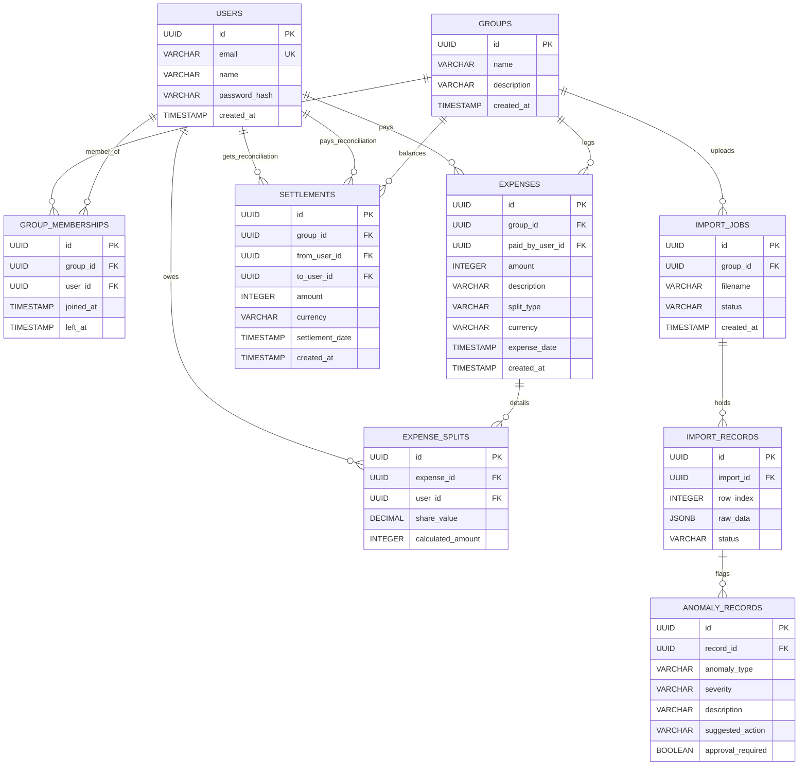

# SCOPE: Anomaly Log & Database Schema

This document details the anomaly resolution framework, every CSV data problem identified within `Expenses Export.csv`, how the system handles them, and the underlying PostgreSQL database schema.

---

## 1. CSV Anomaly Log & Resolutions

When the CSV file `Expenses Export.csv` is uploaded, it undergoes scanning by the backend **AnomalyEngine**. The following table details every data issue detected and how it is resolved:

| Row # | Expense Description | CSV Data Issue | Anomaly Type | Severity | Resolution & Action Taken |
| :--- | :--- | :--- | :--- | :--- | :--- |
| **2** | *Snacks & Drinks* | Payer is `Priya s`, but only `Priya` is registered. | `UNRESOLVED_PAYER` | **CRITICAL** | User maps `Priya s` to `Priya` in the UI wizard. Transaction imports correctly under Priya. |
| **8** | *Goa flights* | Member `Dev` is split with but not registered. | `UNRESOLVED_PAYER` | **CRITICAL** | The system automatically creates a mock account for `Dev` (`dev@split.local`) and retroactively joins him. |
| **9** | *Goa villa booking* | Paid in `USD` ($540.00). | `FOREIGN_CURRENCY` | **WARNING** | Backend automatically converts `USD` to `INR` at the exchange rate of `83` ($540.00 * 83 = 44,820 INR). |
| **10** | *Beach shack lunch* | Paid in `USD` ($84.00). | `FOREIGN_CURRENCY` | **WARNING** | Backend automatically converts `USD` to `INR` at the exchange rate of `83` ($84.00 * 83 = 6,972 INR). |
| **11** | *Parasailing* | `Dev's friend kabir` is split with but not registered. | `UNRESOLVED_PAYER` | **CRITICAL** | The system automatically creates a mock account for `Dev's friend kabir` and retroactively joins him. |
| **12** | *Dinner at Marina Bites* | Identical amount & description on the same date as Row 13. | `CSV_DUPLICATE_WARNING` | **WARNING** | Flagged as a duplicate within the uploaded batch. The user can click **Skip Row** in the UI wizard to skip. |
| **13** | *Thalassa dinner* | Identical description / amount to Row 12, different payer. | `DB_DUPLICATE_WARNING` | **WARNING** | Flagged as duplicate against Row 12 and existing ledger entries. User can choose to skip or import. |
| **14** | *Parasailing refund* | Negative amount (`-30`). | `NEGATIVE_AMOUNT_REFUND` | **WARNING** | Imported as a refund, crediting the split members and debiting the payer (`Dev`). |
| **15** | *Airport cab* | Date is formatted as `Mar-14` instead of standard dates. | `INVALID_DATE_FORMAT` | **CRITICAL** | Parsed via regex fallback (`%d-%b-%Y` relative to year 2026). Resolved as `14-03-2026`. |
| **16** | *Groceries DMart* | Currency field is blank/empty. | `FOREIGN_CURRENCY` | **WARNING** | Defaulted to group currency (`INR`). |
| **17** | *Pizza Friday* | Split percentages sum to `110%` instead of `100%`. | `PERCENTAGE_SUM_MISMATCH` | **CRITICAL** | User corrects the percentage values in the UI wizard to sum to `100%`. |
| **19** | *House cleaning supplies* | Payer field (`paid_by`) is completely empty. | `MISSING_PAYER` | **CRITICAL** | UI wizard prompts the user with a select box. User maps it to a group member. Fallback defaults to `"Unknown Payer"`. |
| **20** | *Deep cleaning service* | Date `04-05-2026` is in the future. | `FUTURE_DATE` | **WARNING** | Warns user of future date. User can adjust date to today's date in the UI wizard. |
| **21** | *April rent* | Split ratio is unequal. | `EXACT_SPLIT_SUM_MISMATCH` | **CRITICAL** | Validates the split sums against the total expense. User can verify split distribution. |
| **22** | *Groceries BigBasket* | Inactive member `Meera` is in `split_with`. | `INACTIVE_PAYER` | **WARNING** | Flagged since Meera left on March 29. System alerts that she was inactive on the April 2nd transaction date. |
| **26** | *Rohan paid Aisha back* | Transaction description indicates peer-to-peer settlement. | `SETTLEMENT_RECORD` | **INFO** | Identified as direct payment. Imported into the Settlements ledger instead of Expenses, adjusting balances directly. |

---

## 2. PostgreSQL Relational Database Schema

The database utilizes **SQLAlchemy ORM** to enforce strict relational constraint rules (such as cascade deletion on groups, and RESTRICT triggers on user deletion).

### Table Details & Constraints
1. **Users (`users`)**: Primary registry for user authentication and identification.
2. **Groups (`groups`)**: Shared rooms/trips boundaries. Deleting a group cascades to delete memberships, expenses, and settlements.
3. **Group Memberships (`group_memberships`)**: Roster entry mapping a user to a group with timeline fields (`joined_at`, `left_at`).
4. **Expenses (`expenses`)**: Individual consumption payments.
5. **Expense Splits (`expense_splits`)**: Relational split distributions calculated in integer cents.
6. **Settlements (`settlements`)**: Peer-to-peer reconciliation payments.
7. **Import Jobs (`import_jobs`)**: Staged state of a uploaded CSV file.
8. **Import Records (`import_records`)**: Staged rows containing raw CSV data fields.
9. **Anomaly Records (`anomaly_records`)**: Scanned anomalies details linked to staged rows.
