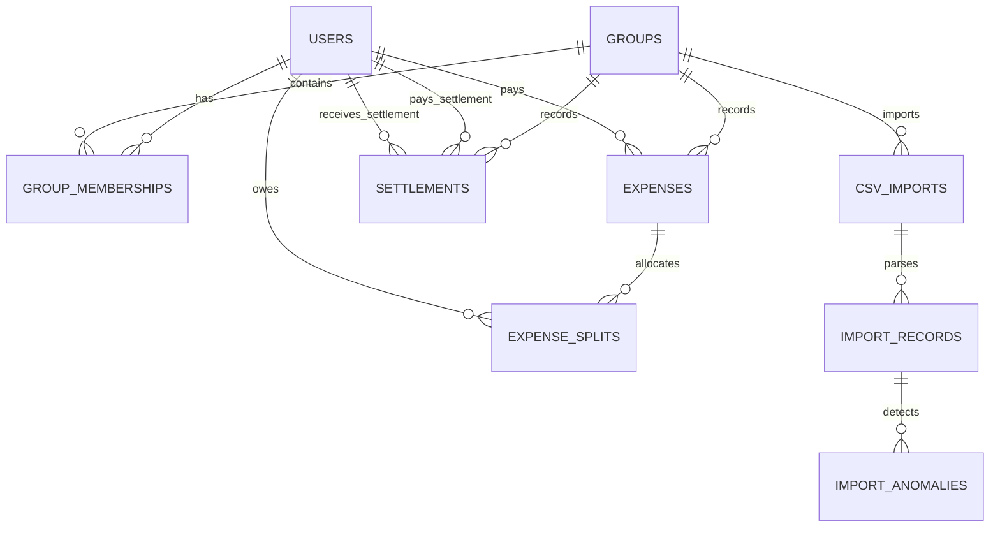
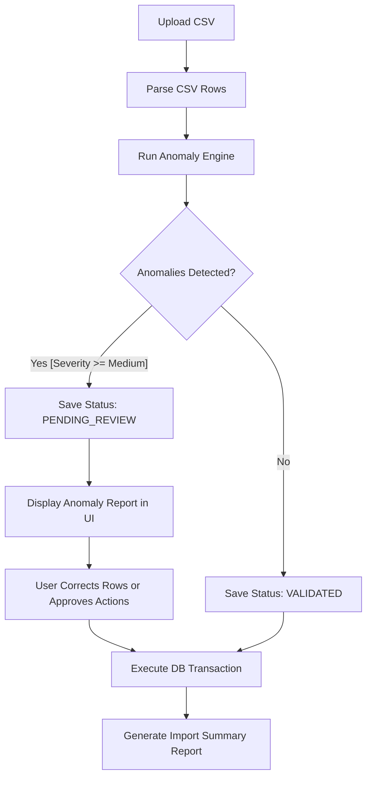

# Shared Expense Management Application: Implementation Plan

This document outlines the end-to-end architecture, database schema, split mechanics, membership timeline logic, anomaly framework, CSV import pipeline, and api design for the Shared Expense Management Application. It is optimized for clarity, ease of maintenance, performance, and interview defense.

---

## SECTION 1 - REQUIREMENT BREAKDOWN

### Functional Requirements
1. **User Management & Authentication**:
   - Register, login, and authenticate users using JWT tokens.
   - Secure passwords using bcrypt hashing.
2. **Group Management**:
   - Create groups and view group details.
   - Manage group membership (join and leave actions) with timeline tracking.
3. **Expense Management**:
   - Create expenses within a group.
   - Support four split types: Equal, Exact, Percentage, and Share-based.
   - Record who paid, the description, total amount, and timestamp.
4. **Settlement Management**:
   - Record peer-to-peer payments (e.g., A paid B $50 to settle debt).
   - Adjust group balances immediately.
5. **Balance Calculation**:
   - Calculate real-time net balances for all members in a group.
   - Restrict expense calculations to the intervals when a user was an active member.
   - Provide simplified settlement pathways (debt simplification) to minimize transactions.
6. **CSV Import Pipeline**:
   - Parse uploaded CSV files containing historical expenses.
   - Validate and run through an anomaly detection framework.
   - Allow user review, manual editing, and approval of imports before committing changes.
   - Output an import summary report.

### Non-Functional Requirements
1. **Precision & Consistency**:
   - Zero floating-point rounding errors. All monetary calculations must use integer cents (e.g., $10.00 is stored as `1000`) and Python's `decimal.Decimal` during computations.
2. **Security**:
   - Scope-based access control: users can only view groups and expenses they belong to.
3. **Scalability & Performance**:
   - Minimize DB queries. Store calculated splits directly to avoid dynamic recalculations.
   - Optimize balance calculation using structured aggregation.
4. **Auditability**:
   - Track CSV imports, membership joining/leaving history, and all settlements.
5. **Timeline Consistency**:
   - Prevent charging a user for expenses that occurred outside their active membership timeline.

### Live Review Evaluation Highlights (High Priority)
- **Split Mathematics**: Correctly handling remainder cents in division (e.g., splitting $10.00 among 3 people).
- **Timeline Logic**: Preventing boundary conditions where an expense is posted at the exact millisecond a user leaves or joins.
- **Anomaly Detection Rules**: Designing an extensible, object-oriented framework for rules rather than a block of nested `if-else` statements.
- **Transactional Integrity**: Ensuring that split allocations are saved atomically with the parent expense.

### Implementation Priority Ranking
1. **Domain Modeling & Database Migrations** (Schema definition, constraints)
2. **Authentication & User/Group Core APIs**
3. **Membership Timeline Logic & Date-Aware Validations**
4. **Expense System & Balance Engine** (Calculated split persistence)
5. **Settlement System** (Direct payments tracking)
6. **Anomaly Framework & CSV Import Parser**
7. **Import Validation, Correction, & Approval APIs**
8. **Interactive React UI Dashboard** (Vibrant styling, graphs, and transaction history)

---

## SECTION 2 - DOMAIN MODELING

To build a highly robust relational model, we normalize all entities and enforce database-level integrity using foreign keys, unique constraints, and checks.



### 1. `users` Table
Stores registered users.
- **`id`**: `UUID` (Primary Key)
- **`email`**: `VARCHAR(255)` (Unique, Indexed)
- **`name`**: `VARCHAR(255)`
- **`password_hash`**: `VARCHAR(255)`
- **`created_at`**: `TIMESTAMP` (Default: timezone-aware current time)

### 2. `groups` Table
Stores groups created for sharing expenses.
- **`id`**: `UUID` (Primary Key)
- **`name`**: `VARCHAR(255)`
- **`description`**: `TEXT` (Nullable)
- **`created_at`**: `TIMESTAMP`

### 3. `group_memberships` Table
Tracks user participation in groups over time. Supporting multiple intervals per user allows users to join, leave, and rejoin later.
- **`id`**: `UUID` (Primary Key)
- **`group_id`**: `UUID` (Foreign Key -> `groups.id`, ON DELETE CASCADE)
- **`user_id`**: `UUID` (Foreign Key -> `users.id`, ON DELETE CASCADE)
- **`joined_at`**: `TIMESTAMP` (Not Null)
- **`left_at`**: `TIMESTAMP` (Nullable)
- **Constraints**:
  - `CHECK (left_at IS NULL OR joined_at < left_at)` (Joined date must precede left date)
  - Index on `(group_id, user_id)` for quick lookup.

### 4. `expenses` Table
Stores details of spent amounts.
- **`id`**: `UUID` (Primary Key)
- **`group_id`**: `UUID` (Foreign Key -> `groups.id`, ON DELETE CASCADE)
- **`paid_by_user_id`**: `UUID` (Foreign Key -> `users.id`, ON DELETE RESTRICT)
- **`amount`**: `INTEGER` (Not Null, amount in cents. E.g., 1000 represents $10.00)
- **`description`**: `VARCHAR(255)` (Not Null)
- **`split_type`**: `VARCHAR(50)` (Not Null, CHECK constraint: `EQUAL`, `EXACT`, `PERCENTAGE`, `SHARE`)
- **`expense_date`**: `TIMESTAMP` (Not Null, the transaction time)
- **`created_at`**: `TIMESTAMP`

### 5. `expense_splits` Table
Persists the final calculated share of the expense for each user. Storing both the input value (like percentage or share ratio) and the final calculated amount prevents round-off drift and avoids expensive on-the-fly recalculations.
- **`id`**: `UUID` (Primary Key)
- **`expense_id`**: `UUID` (Foreign Key -> `expenses.id`, ON DELETE CASCADE)
- **`user_id`**: `UUID` (Foreign Key -> `users.id`, ON DELETE RESTRICT)
- **`share_value`**: `NUMERIC(10, 4)` (Not Null, holds raw split parameter: ratio, exact amount, percentage, or 1.0 for EQUAL)
- **`calculated_amount`**: `INTEGER` (Not Null, final split share in cents)
- **Constraints**:
  - Unique constraint on `(expense_id, user_id)` (Each user can only have one split per expense).

### 6. `settlements` Table
Records money transfers made to resolve net balances.
- **`id`**: `UUID` (Primary Key)
- **`group_id`**: `UUID` (Foreign Key -> `groups.id`, ON DELETE CASCADE)
- **`from_user_id`**: `UUID` (Foreign Key -> `users.id`, debtor, ON DELETE RESTRICT)
- **`to_user_id`**: `UUID` (Foreign Key -> `users.id`, creditor, ON DELETE RESTRICT)
- **`amount`**: `INTEGER` (Not Null, positive transfer amount in cents)
- **`settlement_date`**: `TIMESTAMP` (Not Null)
- **`created_at`**: `TIMESTAMP`
- **Constraints**:
  - `CHECK (from_user_id != to_user_id)` (Cannot settle with oneself)
  - `CHECK (amount > 0)` (Must transfer a positive sum)

### 7. `csv_imports` Table
Tracks CSV files uploaded.
- **`id`**: `UUID` (Primary Key)
- **`group_id`**: `UUID` (Foreign Key -> `groups.id`)
- **`uploaded_by_user_id`**: `UUID` (Foreign Key -> `users.id`)
- **`filename`**: `VARCHAR(255)`
- **`status`**: `VARCHAR(50)` (CHECK constraint: `PENDING_REVIEW`, `PROCESSED`, `REJECTED`)
- **`created_at`**: `TIMESTAMP`

### 8. `import_records` Table
Stores raw rows of the CSV for editing before final execution.
- **`id`**: `UUID` (Primary Key)
- **`import_id`**: `UUID` (Foreign Key -> `csv_imports.id`, ON DELETE CASCADE)
- **`row_index`**: `INTEGER` (Order of row in CSV)
- **`raw_data`**: `JSONB` (Stores CSV columns: description, amount, date, payer_email, split_details)
- **`corrected_data`**: `JSONB` (Nullable, modified row values if edited in UI)
- **`status`**: `VARCHAR(50)` (CHECK constraint: `PENDING`, `VALIDATED`, `SKIPPED`, `PROCESSED`)

### 9. `import_anomalies` Table
Logs errors or warnings detected in a CSV record.
- **`id`**: `UUID` (Primary Key)
- **`import_record_id`**: `UUID` (Foreign Key -> `import_records.id`, ON DELETE CASCADE)
- **`anomaly_type`**: `VARCHAR(100)`
- **`severity`**: `VARCHAR(50)` (CHECK constraint: `INFO`, `WARNING`, `CRITICAL`)
- **`description`**: `TEXT`
- **`suggested_action`**: `TEXT`
- **`is_approved`**: `BOOLEAN` (Default: NULL, becomes TRUE if approved, FALSE if rejected)

---

## SECTION 3 - MEMBERSHIP TIMELINE DESIGN

A group's roster changes over time. When performing balance calculations, we must evaluate group membership relative to the expense timestamp. 

### Rationale & Model
We model memberships using intervals: $[T_{join}, T_{leave})$. 
- An active member has an open interval: $[T_{join}, \infty)$ (represented by `left_at = NULL`).
- A deactivated member has a closed interval: $[T_{join}, T_{leave})$.
- If a user rejoins, a new row is created in `group_memberships` representing a separate interval $[T_{join2}, T_{leave2})$.

### How Splits Evaluate Membership
When creating an expense at timestamp $T_{expense}$:
1. For **EQUAL** splits:
   - Identify all active members at $T_{expense}$. Specifically:
     ```sql
     SELECT user_id FROM group_memberships
     WHERE group_id = :group_id
       AND joined_at <= :expense_date
       AND (left_at IS NULL OR left_at > :expense_date);
     ```
   - Calculate splits equally among this active subset.
2. For **EXACT/PERCENTAGE/SHARE** splits:
   - Validate that every user in the split request was active at $T_{expense}$. If a split targets a user who was not active on that date, it triggers a validation error (or anomaly, if importing).

### Walkthrough Scenario: Meera, Sam, and Bob
- **Day 1**: Bob and Meera form a group.
- **Day 5**: Bob logs a $100 Expense (E1) split EQUALLY.
  - Active members at Day 5: **Bob, Meera**.
  - Split: Bob pays $100; Bob owes $50, Meera owes $50.
- **Day 10**: Meera leaves the group. Her membership record is updated with `left_at = Day 10`.
- **Day 12**: Bob logs a $60 Expense (E2) split EQUALLY.
  - Active members at Day 12: **Bob**. (Meera is inactive).
  - Split: Bob pays $60; Bob owes $60, Meera owes $0.
- **Day 15**: Sam joins the group (`joined_at = Day 15`).
- **Day 18**: Bob logs a $90 Expense (E3) split EQUALLY.
  - Active members at Day 18: **Bob, Sam**.
  - Split: Bob pays $90; Bob owes $45, Sam owes $45.

### Balance Calculation Walkthrough (Net Balances)
- **Bob**: Paid: $+100$ (E1) $+60$ (E2) $+90$ (E3) $= +250$.
  - Owes: $50$ (E1) $+60$ (E2) $+45$ (E3) $= -155$.
  - Net: $+250 - 155 = \mathbf{+95}$.
- **Meera**: Paid: $0$.
  - Owes: $50$ (E1).
  - Net: $0 - 50 = \mathbf{-50}$.
- **Sam**: Paid: $0$.
  - Owes: $45$ (E3).
  - Net: $0 - 45 = \mathbf{-45}$.

Sum of all net balances: $+95 - 50 - 45 = 0$ (Perfect balance conservation).

### Edge Cases & Resolutions
1. **User leaves with an outstanding balance**:
   - *Design decision*: We do not block a user from setting `left_at` (leaving the group) even if their balance is non-zero. Instead, their membership status becomes inactive, but they still owe or are owed money. The system continues to display them in the balance sheet until settled.
2. **Expense logged on the exact boundary**:
   - Timestamps are compared using closed start, open end: `joined_at <= expense_date < left_at`. This prevents double-split errors on split-second transfers.
3. **Re-joining**:
   - Creating a second row in the table ensures they have two valid intervals. The SQL parser matches both intervals using an `OR` condition.

---

## SECTION 4 - EXPENSE SYSTEM DESIGN

The system handles multiple split types. To prevent floating-point issues, all database values must represent integer cents.

### Split Storage & Calculations

| Split Type | User Inputs | Storage in `expense_splits` | Calculation Formula |
| :--- | :--- | :--- | :--- |
| **EQUAL** | None (Auto-split) | `share_value = 1.0` | $Total \div N$ active members. Remainder distributed. |
| **EXACT** | Specific amounts (cents) | `share_value = exact_amount` | Directly assigned. Validate that $\sum Splits = Total$. |
| **PERCENTAGE** | Percent values (e.g., 40.0) | `share_value = percentage` | $(Total \times percentage) \div 100$. Remainder distributed. |
| **SHARE** | Number of shares (e.g., 2, 1) | `share_value = shares` | $Total \times (user\_shares \div \sum shares)$. Remainder distributed. |

### Remainder Cent Distribution (The "Penny-Rounding" Problem)
When dividing amounts, division remainders can create discrepancy. For instance, splitting $10.00 (1000 cents) equally among 3 users yields $333.3333...$ cents.
- **Handling Strategy**:
  1. Perform integer division for each user's split: `amount_cents // num_users`.
  2. Compute the remainder: `remainder = amount_cents % num_users`.
  3. Distribute the remainder cent-by-cent ($1$ cent per user) to the first $N$ participants, starting with the **payer** (or ordered alphabetically by user ID to remain deterministic).
  - *Example*:
    - Total: 1000 cents. Users: A (Payer), B, C.
    - Base share: $1000 \div 3 = 333$ cents. Remainder = 1.
    - User A (Payer) gets: $333 + 1 = 334$ cents.
    - User B gets: 333 cents.
    - User C gets: 333 cents.
    - Total split sum: $334 + 333 + 333 = 1000$ cents. (Preserved perfectly).

---

## SECTION 5 - SETTLEMENT SYSTEM

Settlements are peer-to-peer transfers intended to clear debts.

### Database Representation
```sql
CREATE TABLE settlements (
    id UUID PRIMARY KEY,
    group_id UUID REFERENCES groups(id) ON DELETE CASCADE,
    from_user_id UUID REFERENCES users(id) ON DELETE RESTRICT,
    to_user_id UUID REFERENCES users(id) ON DELETE RESTRICT,
    amount INTEGER NOT NULL CHECK (amount > 0),
    settlement_date TIMESTAMP NOT NULL,
    created_at TIMESTAMP DEFAULT CURRENT_TIMESTAMP
);
```

### Differences: Expenses vs. Settlements

| Feature | Expense | Settlement |
| :--- | :--- | :--- |
| **Purpose** | Records consumption of goods/services | Records direct payment of money to resolve debt |
| **Splits** | Requires split calculations (who owes what) | Direct peer-to-peer transaction (No splits) |
| **Balance Effect** | Debits active split members; Credits payer | Debits receiver; Credits sender |
| **Deletion Rule** | Recalculates splits for all members | Adjusts simple ledger balances |

### Effect on Balances
A settlement of amount $X$ from User A to User B:
- **Reduces** User A's outstanding debt (A gets a $+X$ adjustment to their balance).
- **Reduces** User B's credit (B gets a $-X$ adjustment to their balance).
- In the final balance calculation, settlements directly counter-balance expense splits.

---

## SECTION 6 - IMPORT PIPELINE DESIGN

CSV imports allow bulk loading of historical group data. However, imports can be messy. Our pipeline parses and screens data, prompting corrections before finalizing transactions.



### Step-by-Step Pipeline Execution
1. **Upload & Parse**:
   - User uploads a CSV with headers: `date`, `description`, `amount`, `payer_email`, `split_type`, `participants_and_shares`.
   - File is parsed into JSON records in the `import_records` table.
2. **Anomaly Scan**:
   - The system executes rules defined in the Anomaly Framework against each record.
   - Any rule failure creates a row in `import_anomalies`.
3. **Review Phase**:
   - If warnings or critical issues are found, the import is set to `PENDING_REVIEW`.
   - The API returns the list of anomalies and suggested fixes.
4. **Correction & Resolution**:
   - The user can modify values (e.g., matching a misspelled email to an existing group member) through the UI dashboard.
   - User clicks "Approve Import".
5. **Execution Transaction**:
   - The backend runs a database transaction:
     - Resolves any user modifications.
     - Adds missing group memberships (if auto-approved).
     - Inserts the `expenses` and corresponding `expense_splits`.
     - Sets the import status to `PROCESSED`.
6. **Report Generation**:
   - Generates a summary report: Total Rows, Successful Imports, Anomalies Resolved, Total Volume Imported.

---

## SECTION 7 - ANOMALY FRAMEWORK

To keep code clean and testable, we avoid hardcoded `if/else` checks, modeling rules as separate, registrable classes inheriting from a base class.

### Code Pattern (Python/FastAPI)
```python
from abc import ABC, abstractmethod
from typing import Dict, List, Optional
from pydantic import BaseModel

class AnomalyResult(BaseModel):
    anomaly_type: str
    severity: str  # INFO, WARNING, CRITICAL
    description: str
    suggested_action: str
    approval_required: bool

class AnomalyRule(ABC):
    @abstractmethod
    def detect(self, row_data: Dict, context: Dict) -> Optional[AnomalyResult]:
        pass
```

### Rule Registry Definitions

#### 1. `InactiveMemberRule`
- **Detection Logic**: Checks if the `payer_email` or split participants are members of the group.
- **Severity**: `CRITICAL`
- **Suggested Action**: "Invite user to group or map to an existing member"
- **Approval Required**: True

#### 2. `SplitMismatchRule`
- **Detection Logic**: If split type is `EXACT`, verifies if the split sum equals the total amount. If `PERCENTAGE`, verifies that the percentages sum up to 100%.
- **Severity**: `CRITICAL`
- **Suggested Action**: "Distribute rounding differences to payer or adjust splits manually"
- **Approval Required**: True

#### 3. `DuplicateExpenseRule`
- **Detection Logic**: Scans existing DB records for an expense in the same group with the identical date, amount, and description.
- **Severity**: `WARNING`
- **Suggested Action**: "Skip importing this row to avoid double charging"
- **Approval Required**: True

#### 4. `FutureDateRule`
- **Detection Logic**: Checks if `expense_date` is in the future.
- **Severity**: `WARNING`
- **Suggested Action**: "Adjust expense date to current timestamp"
- **Approval Required**: True

#### 5. `NegativeOrZeroAmountRule`
- **Detection Logic**: Checks if `amount` is $\le 0$.
- **Severity**: `CRITICAL`
- **Suggested Action**: "Ignore this record or enter a positive amount"
- **Approval Required**: True

---

## SECTION 8 - BALANCE CALCULATION ENGINE

The Balance Engine determines how much each user owes or is owed within a group.

### Mathematical Definition of Net Balance
Let $G$ be the group.
- $E_G$ is the set of all expenses in $G$.
- $S_G$ is the set of all settlements in $G$.
- For an expense $e \in E_G$:
  - $P(e)$ is the user who paid.
  - $A(e)$ is the total amount of the expense.
  - $O(e, i)$ is the obligation amount assigned to user $i$ in `expense_splits`. If user $i$ was not in the split, $O(e, i) = 0$.
- For a settlement $s \in S_G$:
  - $F(s)$ is the sender (`from_user_id`).
  - $T(s)$ is the receiver (`to_user_id`).
  - $Set(s)$ is the settlement amount.

The Net Balance $B(i)$ for user $i$ in group $G$ is computed as:
$$B(i) = \sum_{e \in E_G, P(e)=i} A(e) - \sum_{e \in E_G} O(e, i) + \sum_{s \in S_G, F(s)=i} Set(s) - \sum_{s \in S_G, T(s)=i} Set(s)$$

### Interpretation
- **$B(i) > 0$**: The user is owed money (Creditor).
- **$B(i) < 0$**: The user owes money (Debtor).
- **$B(i) = 0$**: The user is fully settled.

### Step-by-Step Balance Calculation Algorithm
```python
def calculate_group_balances(group_id: UUID, db_session) -> Dict[UUID, int]:
    # 1. Initialize balances map for all group users
    balances = {user.id: 0 for user in get_group_members(group_id)}
    
    # 2. Add credits for expense payments and subtract split debits
    # Optimize by querying expenses and join with splits in a single batch
    splits = db_session.query(ExpenseSplit).join(Expense).filter(Expense.group_id == group_id).all()
    for split in splits:
        # Payer gets credited with the amount they paid (processed once per expense)
        if split.expense.paid_by_user_id in balances:
            # Note: We credit the payer for the total amount of the expense
            # then subtract their split share along with everyone else.
            pass
            
    # To execute cleanly:
    # Query total paid per user
    payments = db_session.query(Expense.paid_by_user_id, func.sum(Expense.amount)).filter(Expense.group_id == group_id).group_by(Expense.paid_by_user_id).all()
    for payer_id, total_paid in payments:
        if payer_id in balances:
            balances[payer_id] += total_paid
            
    # Query total obligations (splits) per user
    obligations = db_session.query(ExpenseSplit.user_id, func.sum(ExpenseSplit.calculated_amount)).join(Expense).filter(Expense.group_id == group_id).group_by(ExpenseSplit.user_id).all()
    for user_id, total_owed in obligations:
        if user_id in balances:
            balances[user_id] -= total_owed
            
    # 3. Adjust for Settlements
    # Settlements out (sent): increases balance (decreases debt)
    sent_settlements = db_session.query(Settlement.from_user_id, func.sum(Settlement.amount)).filter(Settlement.group_id == group_id).group_by(Settlement.from_user_id).all()
    for sender_id, total_sent in sent_settlements:
        if sender_id in balances:
            balances[sender_id] += total_sent
            
    # Settlements in (received): decreases balance (decreases credit)
    received_settlements = db_session.query(Settlement.to_user_id, func.sum(Settlement.amount)).filter(Settlement.group_id == group_id).group_by(Settlement.to_user_id).all()
    for receiver_id, total_received in received_settlements:
        if receiver_id in balances:
            balances[receiver_id] -= total_received
            
    return balances
```

### Debt Simplification Algorithm (Min-Flow Settlement)
Rather than making everyone pay each other back individually, we simplify balances to minimize the total transactions required.
- **Example**:
  - Balances: Alice: $+50$, Bob: $-30$, Charlie: $-20$.
  - Without simplification: Bob pays Alice $30$; Charlie pays Alice $20$. (2 transactions).
  - Implementation using a greedy approach:
    1. Separate members into two lists: `debtors` (negative balances) and `creditors` (positive balances).
    2. Sort both lists: debtors ascending (largest debt first), creditors descending (largest credit first).
    3. Greedily match the largest debtor with the largest creditor:
       - $TransferAmount = \min(|DebtorBalance|, CreditorBalance)$.
       - Record transfer: Debtor pays Creditor $TransferAmount$.
       - Update balances of both. Remove any participant whose balance hits 0.
    4. Repeat until all balances are resolved.
    - **Complexity**: $O(N \log N)$ where $N$ is the number of group members. Highly performant for normal group sizes.

---

## SECTION 9 - API DESIGN

### Authentication Endpoints
- **`POST /api/auth/register`**: Register a new account.
  - *Request Body*: `{"email": "user@example.com", "password": "securepassword", "name": "Alice"}`
  - *Response*: `{"id": "uuid-1", "email": "user@example.com", "name": "Alice"}`
- **`POST /api/auth/login`**: Retrieve authentication token.
  - *Request Body*: `{"email": "user@example.com", "password": "securepassword"}`
  - *Response*: `{"access_token": "jwt-token-string", "token_type": "bearer"}`
- **`GET /api/auth/me`**: Get logged-in user profile.
  - *Headers*: `Authorization: Bearer <token>`
  - *Response*: `{"id": "uuid-1", "email": "user@example.com", "name": "Alice"}`

### Group Endpoints
- **`POST /api/groups`**: Create a new group.
  - *Request Body*: `{"name": "Roommates", "description": "Shared apartment expenses"}`
  - *Response*: `{"id": "group-uuid", "name": "Roommates", "created_at": "timestamp"}`
- **`GET /api/groups`**: List all groups the logged-in user belongs to.
  - *Response*: `[{"id": "group-uuid", "name": "Roommates", "description": "..."}]`

### Group Members (Timeline) Endpoints
- **`POST /api/groups/{group_id}/members`**: Add a member to a group.
  - *Request Body*: `{"user_id": "user-uuid"}`
  - *Response*: `{"membership_id": "member-uuid", "user_id": "user-uuid", "joined_at": "timestamp"}`
- **`DELETE /api/groups/{group_id}/members/{user_id}`**: Mark a member as left (updates `left_at`).
  - *Response*: `{"status": "deactivated", "left_at": "timestamp"}`

### Expense Endpoints
- **`POST /api/groups/{group_id}/expenses`**: Log a new expense.
  - *Request Body*:
    ```json
    {
      "description": "Groceries",
      "amount": 6000,
      "paid_by_user_id": "user-uuid-1",
      "expense_date": "2026-06-14T12:00:00Z",
      "split_type": "PERCENTAGE",
      "splits": [
        {"user_id": "user-uuid-1", "share_value": 60.0},
        {"user_id": "user-uuid-2", "share_value": 40.0}
      ]
    }
    ```
  - *Response*: `{"expense_id": "uuid", "description": "Groceries", "total_amount": 6000, "splits": [...]}`
- **`GET /api/groups/{group_id}/expenses`**: List all expenses in a group.
  - *Response*: `[{"id": "uuid", "description": "Groceries", "amount": 6000, "paid_by": "Alice"}]`

### Settlement Endpoints
- **`POST /api/groups/{group_id}/settlements`**: Record a settlement.
  - *Request Body*:
    ```json
    {
      "from_user_id": "debtor-uuid",
      "to_user_id": "creditor-uuid",
      "amount": 2000,
      "settlement_date": "2026-06-14T15:00:00Z"
    }
    ```
  - *Response*: `{"settlement_id": "uuid", "from": "Bob", "to": "Alice", "amount": 2000}`

### Import Pipeline Endpoints
- **`POST /api/groups/{group_id}/imports/upload`**: Upload a CSV for analysis.
  - *Request*: `multipart/form-data` with CSV file.
  - *Response*:
    ```json
    {
      "import_id": "import-uuid",
      "status": "PENDING_REVIEW",
      "anomalies_count": 2,
      "records": [
        {
          "record_id": "rec-uuid",
          "raw_data": {"description": "Gas", "amount": "50.00", "..."},
          "anomalies": [
            {
              "type": "InactiveMemberRule",
              "severity": "CRITICAL",
              "description": "Payer email not in group.",
              "suggested_action": "Invite or map to existing member"
            }
          ]
        }
      ]
    }
    ```
- **`POST /api/imports/{import_id}/approve`**: Approve and run the import.
  - *Request Body*:
    ```json
    {
      "resolutions": [
        {"record_id": "rec-uuid", "action": "MAP_USER", "param": "existing-user-uuid"}
      ]
    }
    ```
  - *Response*: `{"status": "PROCESSED", "imported_expenses_count": 15}`

### Balance Endpoints
- **`GET /api/groups/{group_id}/balances`**: Get net balances and simplified debt settlement flow.
  - *Response*:
    ```json
    {
      "net_balances": {
        "user-uuid-1": 5000,
        "user-uuid-2": -3000,
        "user-uuid-3": -2000
      },
      "simplified_settlements": [
        {
          "from_user_id": "user-uuid-2",
          "to_user_id": "user-uuid-1",
          "amount": 3000
        },
        {
          "from_user_id": "user-uuid-3",
          "to_user_id": "user-uuid-1",
          "amount": 2000
        }
      ]
    }
    ```

---

## SECTION 10 - PROJECT STRUCTURE

A clean monorepo or split folder design is employed. It segregates logic to facilitate testing while keeping dependencies straightforward.

```
split-expenser/
├── backend/
│   ├── app/
│   │   ├── core/
│   │   │   ├── config.py         # App configurations
│   │   │   ├── database.py       # Session maker, declarative base
│   │   │   └── security.py       # Password hash, JWT helpers
│   │   ├── models/
│   │   │   ├── user.py           # SQL Alchemy user entity
│   │   │   ├── group.py          # Group & Membership entities
│   │   │   ├── expense.py        # Expense & Split entities
│   │   │   ├── settlement.py     # Settlement entity
│   │   │   └── imports.py        # Import tracking entities
│   │   ├── schemas/
│   │   │   ├── user.py           # Pydantic auth schemas
│   │   │   ├── expense.py        # Pydantic split & expense schemas
│   │   │   └── settlement.py     # Pydantic settlement schemas
│   │   ├── crud/
│   │   │   ├── user_crud.py      # Database operations for users
│   │   │   └── expense_crud.py   # Database operations for expenses
│   │   ├── routers/
│   │   │   ├── auth.py           # Login, register APIs
│   │   │   ├── groups.py         # Group and membership APIs
│   │   │   ├── expenses.py       # Expense routes
│   │   │   ├── settlements.py    # Settlement routes
│   │   │   ├── imports.py        # CSV import routes
│   │   │   └── balances.py       # Balance calculation routes
│   │   ├── services/
│   │   │   ├── balance_engine.py # Math engine, simplification code
│   │   │   ├── csv_parser.py     # Stream CSV, basic checks
│   │   │   └── anomalies.py      # Extensible anomaly framework
│   │   └── main.py               # FastAPI application entrypoint
│   ├── tests/
│   │   ├── conftest.py           # SQLite in-memory test setup
│   │   ├── test_balances.py      # Unit tests for mathematics/rounding
│   │   └── test_anomalies.py     # Unit tests for anomaly framework
│   ├── requirements.txt
│   └── Dockerfile
└── frontend/
    ├── src/
    │   ├── components/           # Reusable UI widgets
    │   ├── context/              # Global auth & state context
    │   ├── hooks/                # Custom React query/fetch hooks
    │   ├── pages/                # Dashboard, Group, Upload page views
    │   ├── App.jsx               # Entry component and router configuration
    │   ├── index.css             # Main styling base
    │   └── main.jsx
    ├── package.json
    └── vite.config.js
```

---

## SECTION 11 - DEVELOPMENT ROADMAP

A tight 2-day timeline requires strict progression along the critical path to ensure a working product can be demonstrated on time.

### Day 1: Backend Core, Schema, and Mathematical Engines (Estimated: 10 Hours)
1. **DB Setup & Migration Init** (2 hours)
   - Initialise database and define core SQLAlchemy model mappings (`users`, `groups`, `memberships`, `expenses`, `splits`, `settlements`).
2. **Auth & Group API Endpoints** (2.5 hours)
   - Create registration, login, JWT validation, and group CRUD.
3. **Membership Timeline Integration** (2 hours)
   - Implement date-aware queries to retrieve valid group members on a given date.
4. **Balance Calculation & Debt Simplification** (3.5 hours)
   - Code split calculations (Equal, Exact, Percentage, Share) including remainder penny rounding.
   - Code the min-flow debt simplification engine. Write basic pytest cases for verification.

### Day 2: Importer, API Finalisation, and Responsive UI (Estimated: 13 Hours)
1. **Anomaly Framework & CSV Pipeline** (4 hours)
   - Build abstract `AnomalyRule` interface and register core checkers.
   - Code `csv_parser.py` parsing engine and DB persistence for review tables.
2. **Import Approval & Settlement Endpoints** (2 hours)
   - Build API routes to retrieve review rows, modify values, and batch-execute insertions.
3. **React Frontend Core & Styling Setup** (2 hours)
   - Set up Vite, Tailwind/Vanilla styling foundations with dark mode. Create core layouts.
4. **Interactive UI Dashboards** (3.5 hours)
   - Build Dashboard showing balance overview.
   - Build Group Detail with expense feed, settlement action modal, and membership timeline toggle.
   - Build CSV Import Review wizard interface.
5. **E2E verification & Polish** (1.5 hours)
   - Run manual import and split scenarios. Resolve visual styling or boundary glitches.

*Critical Path*: DB Schema $\rightarrow$ Balance Math Engine $\rightarrow$ Anomaly Parser $\rightarrow$ Approval APIs $\rightarrow$ Frontend Views.

---

## SECTION 12 - INTERVIEW DEFENSE PREPARATION

### Q1: Why did you decide to store calculated split amounts in the database instead of computing them dynamically?
*Answer*: Computing split amounts dynamically requires scanning the entire history of membership changes, split ratios, and percentages whenever a query is run. This is computationally expensive ($O(K \cdot N)$ where $K$ is expenses count and $N$ is group size) and vulnerable to rounding mismatches if group configurations or percentages change. Storing `calculated_amount` directly freezes the split value at creation, ensuring auditability, reducing database queries, and preserving constant-time balance calculations.

### Q2: How does your system deal with a member leaving the group when they still owe or are owed money?
*Answer*: We record their departure by setting `left_at` in their membership, which excludes them from future expenses. However, we do not delete the user or delete past records. Their net balance calculation is historical, evaluating transactions that occurred when they were active. The balance remains on the sheet. The user is displayed as "Inactive (Settlement Pending)" in the UI. They can settle up later. Once their net balance is exactly $0$, they are fully settled but their history remains locked.

### Q3: What is your strategy for handling the remainder penny when splitting odd amounts?
*Answer*: When an amount cannot be split cleanly (e.g., $10.00 / 3$), we perform integer division to calculate a base split of $3.33 (333 cents). The remaining $0.01 (1 cent) is added to the split of the payer. If there are multiple remainder pennies (e.g., splitting a share ratio), we distribute them cent-by-cent to the first participants in alphabetical order of their IDs. This preserves the financial invariant: $\sum Splits = TotalAmount$ exactly.

### Q4: Why did you choose to model CSV Imports with a review/approval phase rather than running auto-inserts?
*Answer*: Automated bulk uploads in financial systems are prone to errors (e.g. unknown email addresses, invalid split formats, or duplication). An immediate auto-insert can pollute production data, which is difficult to reverse. By creating intermediary tables (`csv_imports`, `import_records`), we can safely store raw records, flag anomalies, and let the user interactively correct mapping errors before committing writes to the production ledger.

### Q5: How do you verify the correctness of the Balance Engine?
*Answer*: The core invariant of any closed group is that the sum of all net balances must equal zero: $\sum B(i) = 0$. In our test suite, we run mock transactions (equal splits, exact amounts, percentage splits, and settlements) and assert that this invariant holds at every step. We also test boundary dates for joining and leaving to ensure users are never allocated splits for expenses outside their active membership timeline.

---

## SECTION 13 - PROPOSED CHANGES & VERIFICATION PLAN

### Proposed Changes

#### [NEW] [config.py](file:///c:/Users/B.PAVANKALYAN%20REDDY/Desktop/SPLIT%20EXPENSER/backend/app/core/config.py)
#### [NEW] [database.py](file:///c:/Users/B.PAVANKALYAN%20REDDY/Desktop/SPLIT%20EXPENSER/backend/app/core/database.py)
#### [NEW] [security.py](file:///c:/Users/B.PAVANKALYAN%20REDDY/Desktop/SPLIT%20EXPENSER/backend/app/core/security.py)
#### [NEW] [models](file:///c:/Users/B.PAVANKALYAN%20REDDY/Desktop/SPLIT%20EXPENSER/backend/app/models)
#### [NEW] [schemas](file:///c:/Users/B.PAVANKALYAN%20REDDY/Desktop/SPLIT%20EXPENSER/backend/app/schemas)
#### [NEW] [routers](file:///c:/Users/B.PAVANKALYAN%20REDDY/Desktop/SPLIT%20EXPENSER/backend/app/routers)
#### [NEW] [services](file:///c:/Users/B.PAVANKALYAN%20REDDY/Desktop/SPLIT%20EXPENSER/backend/app/services)
#### [NEW] [main.py](file:///c:/Users/B.PAVANKALYAN%20REDDY/Desktop/SPLIT%20EXPENSER/backend/app/main.py)
#### [NEW] [tests](file:///c:/Users/B.PAVANKALYAN%20REDDY/Desktop/SPLIT%20EXPENSER/backend/tests)
#### [NEW] [frontend](file:///c:/Users/B.PAVANKALYAN%20REDDY/Desktop/SPLIT%20EXPENSER/frontend)

### Verification Plan

#### Automated Tests
We will execute standard unit tests using `pytest` to verify the mathematical models and timeline validations:
- Run `pytest backend/tests/` inside the backend directory to check:
  - Base user login and registration routes.
  - Correct splits calculation under extreme penny splitting cases.
  - Active timeline boundary queries.
  - Anomaly registry triggers.

#### Manual Verification
- We will deploy the FastAPI server locally and test importing a dummy CSV containing known issues (like a non-member email and mismatching amounts).
- We will verify that the dashboard UI flags these anomalies, allows correcting them via a select drop-down, and transitions them into expenses on confirmation.
